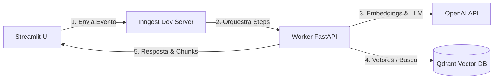

# 📄 PDF RAG AI Agent

> **Projeto prático de estudos** explorando a construção de um pipeline de **RAG (Retrieval-Augmented Generation)** orientado a eventos (*Event-Driven*) com execução durável, desacoplamento assíncrono e banco vetorial.


---

## 🎯 Sobre o Projeto & Contexto

Este repositório é fruto de uma jornada prática de estudos sobre **Agentes de IA e Arquiteturas RAG**. O objetivo foi ir além dos scripts tutoriais básicos de "carregar PDF e chamar LLM em uma função síncrona", implementando um fluxo desacoplado e confiável para cenários reais.

### O Desafio Abordado
Em aplicações RAG tradicionais:
- Processar e vetorizar PDFs grandes dentro do ciclo síncrono de uma requisição HTTP causa *timeouts*, travamento de interfaces e falhas silenciosas.
- Falhas de rede durante chamadas à API de embeddings ou ao banco vetorial perdem todo o progresso do documento.
- Falta de controle de vazão (*rate limiting*) pode estourar as cotas das APIs de modelos.

### A Solução Explorada
Uma arquitetura orientada a eventos utilizando **Inngest** como motor de execução durável (*durable execution*), **Qdrant** como banco vetorial de alta performance, **LlamaIndex** para parsing/chunking estruturado e **Streamlit** como interface de demonstração.

---

## 🏗️ Arquitetura do Sistema

```text
                     FLUXO DE INGESTÃO (PDF)
  [ Streamlit UI ] ──────► [ Inngest Event ] ──────► [ FastAPI Worker ]
   (Upload do PDF)          (rag/ingest_pdf)           │
                                                       ├── 1. Chunking (LlamaIndex)
                                                       ├── 2. Embeddings (OpenAI)
                                                       └── 3. Upsert (UUID5)
                                                                 │
                                                                 ▼
                                                       [( Qdrant Vector DB )]
                                                                 ▲
                     FLUXO DE CONSULTA (RAG)                     │
  [ Streamlit UI ] ──────► [ Inngest Event ] ──────► [ FastAPI Worker ]
  (Pergunta do Usuário)    (rag/query_pdf_ai)          │
         ▲                                             ├── 1. Busca Semântica (Top-K)
         │                                             └── 2. Síntese LLM (gpt-4o-mini)
         └──────────────── Retorno da Resposta ────────┘
```

<details>
<summary><b>Visualizar diagrama interativo em Mermaid</b> (renderizado no GitHub)</summary>



</details>

---

## 🧠 Conceitos e Decisões Técnicas

| Conceito | Implementação no Projeto | Benefício Prático |
| :--- | :--- | :--- |
| **Execução Durável (Durable Steps)** | `ctx.step.run` e `ctx.step.ai.infer` via Inngest | Cada etapa (chunking, embedding, inferência) é memorizada de forma idempotente. Se uma etapa falhar, o workflow retoma dali sem refazer o que já concluiu. |
| **Idempotência de Vetores** | Geração de identificadores com `uuid.uuid5` | Os pontos no Qdrant recebem um UUID determinístico baseado no nome do arquivo e no índice do chunk (`{source_id}:{index}`). Reprocessar o mesmo arquivo não cria duplicatas. |
| **Proteção de Cotas (Rate Limiting & Throttle)** | `@inngest_client.create_function(throttle=..., rate_limit=...)` | Limita o processamento em lote a 2 execuções por minuto e evita ingestões repetidas acidentais do mesmo documento. |
| **Parsing Estruturado** | `SentenceSplitter` do LlamaIndex (chunk 1000, overlap 200) | Evita cortar frases no meio, preservando a coerência semântica necessária para o modelo de embeddings (`text-embedding-3-large`). |
| **Transparência de Grounding** | Inspeção dos *Top-K Chunks* no frontend | Permite verificar exatamente quais fragmentos do PDF foram recuperados do banco vetorial para formular a resposta, evidenciando o funcionamento do RAG. |

---

## 📂 Estrutura de Pastas

```text
PDF_RAG_AI_Agent/
├── custom_types.py      # Modelos Pydantic para tipagem estática entre steps
├── data_loader.py       # Extração do PDF (LlamaIndex) e geração de embeddings (OpenAI)
├── vector_db.py         # Cliente e operações de upsert/busca por cosseno no Qdrant
├── main.py              # Aplicação FastAPI e definição dos workflows Inngest
├── streamlit_app.py     # Interface interativa (upload, monitoramento e chat RAG)
├── pyproject.toml       # Dependências e metadados gerenciados com UV
├── .env.example         # Modelo de variáveis de ambiente
├── .gitignore           # Proteção contra commit de chaves e dados locais
└── README.md            # Documentação do projeto
```

---

## 🚀 Como Executar Localmente

### 1. Pré-requisitos
- **Python 3.13+** (recomendado usar [uv](https://docs.astral.sh/uv/))
- **Docker** (para subir a instância do Qdrant)
- **Node.js 18+** (para o Inngest CLI)
- **Chave de API da OpenAI**

### 2. Clonar o Repositório e Configurar o Ambiente
```bash
# Clone o repositório
git clone https://github.com/seu-usuario/pdf-rag-ai-agent.git
cd pdf-rag-ai-agent

# Crie o arquivo .env a partir do template
cp .env.example .env
```
Edite o arquivo `.env` inserindo sua chave da OpenAI:
```env
OPENAI_API_KEY=sk-proj-sua-chave-aqui
QDRANT_URL=http://localhost:6333
INNGEST_API_BASE=http://127.0.0.1:8288/v1
```

### 3. Instalar as Dependências com UV
```bash
uv sync
```

### 4. Iniciar os Serviços

Para o funcionamento completo, você precisará de 4 processos em terminais separados (ou em segundo plano):

#### Terminal 1: Qdrant Vector Database (via Docker)
```bash
docker run -p 6333:6333 -p 6334:6334 \
    -v $(pwd)/qdrant_storage:/qdrant/storage:z \
    qdrant/qdrant
```

#### Terminal 2: Inngest Dev Server
```bash
npx inngest-cli@latest dev -u http://127.0.0.1:8000/api/inngest --no-discovery
```
> O painel do Inngest ficará acessível em: `http://127.0.0.1:8288`

#### Terminal 3: Backend FastAPI
```bash
uv run python -m uvicorn main:app --reload
```
> A API ficará acessível em: `http://127.0.0.1:8000` (docs em `/docs`)

#### Terminal 4: Frontend Streamlit
```bash
uv run streamlit run streamlit_app.py
```
> A interface web abrirá automaticamente em: `http://localhost:8501`

---

## 🧪 Como Testar a Aplicação

1. **Acesse o Streamlit** (`http://localhost:8501`).
2. Verifique na barra lateral se os indicadores de **FastAPI**, **Inngest** e **Qdrant** estão verdes (`Online`).
3. No painel esquerdo (**1. Ingestão de Documento**), faça upload de um arquivo PDF e clique em **"Processar e Indexar Documento"**.
4. Acesse o **[Inngest Dashboard](http://127.0.0.1:8288)** para ver os steps `load-and-chunk` e `embed-and-upsert` sendo executados em tempo real com telemetria completa.
5. No painel direito (**2. Consulta Semântica**), faça uma pergunta sobre o documento enviado.
6. Observe a resposta gerada, as fontes consultadas e expanda a seção **"Inspecionar os fragmentos recuperados"** para auditar os chunks reais extraídos do Qdrant.

---

## 📈 Lições Aprendidas & Evoluções Futuras

### O que este estudo proporcionou:
- **Separação de Preocupações**: Compreensão prática de como arquiteturas orientadas a eventos evitam o acoplamento excessivo entre a interface e tarefas computacionalmente intensas.
- **Resiliência de Workflows**: Vantagens do padrão de execução durável frente a simples threads ou tarefas em background sem persistência de estado.
- **Métricas de Similaridade**: Uso de embeddings densos de 3072 dimensões com busca por distância cosseno no Qdrant.

### Próximos Passos de Estudo (Roadmap):
- [ ] Implementar **Busca Híbrida (Hybrid Search)** combinando busca por palavras-chave (BM25) e busca vetorial densa.
- [ ] Adicionar etapa de **Reranking** (ex: Cohere Rerank ou Cross-Encoder) antes de enviar os chunks ao modelo gerador.
- [ ] Suporte a histórico de conversas (*Multi-turn Chat*) com sumarização de memória.

---

## 👨‍💻 Autor

Desenvolvido por **Mykael Querido** como projeto prático de estudos em Inteligência Artificial e Agentes Autônomos.

- **Email**: [mykaqms@gmail.com](mailto:mykaqms@gmail.com)
- **GitHub**: [@mykaelquerido](https://github.com/MykaQMS)
- **LinkedIn**: [Meu LinkedIn](https://www.linkedin.com/in/mykaelquerido/)