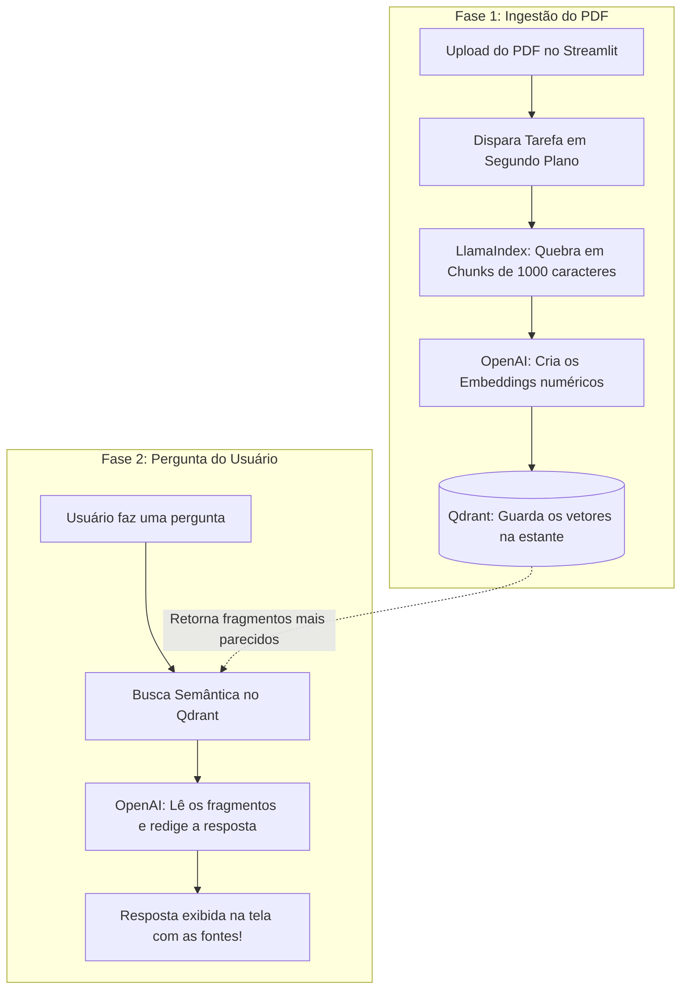

# 📄 PDF RAG AI Agent: Do Básico ao Mundo Real

> **Guia prático e didático** para estudantes e desenvolvedores que querem aprender **RAG (Retrieval-Augmented Generation)** na prática, entendendo como conectar PDFs, bancos vetoriais e modelos de linguagem sem travar a aplicação.


---

## 💡 O que é RAG e por que ele é tão importante?

Se você já conversou com o ChatGPT ou qualquer outra IA, provavelmente reparou em duas coisas:
1. **Elas não conhecem seus arquivos particulares** (como um contrato, um manual interno ou um relatório da sua empresa).
2. **Às vezes elas "alucinam"**: quando não sabem uma resposta com certeza, podem inventar informações convincentes, mas falsas.

É aqui que entra o **RAG (Geração Aumentada por Recuperação)**.

### A Analogia da "Prova com Consulta" 📚

Pense nos modelos de IA como alunos muito inteligentes. 
* Sem RAG, a IA faz uma **prova sem consulta**: responde apenas com o que decorou durante o treinamento dela na internet.
* Com RAG, nós damos à IA uma **prova com consulta**: antes de responder à sua pergunta, o sistema consulta seu PDF, encontra exatamente as páginas e parágrafos relevantes e entrega para a IA dizendo: *"Responda à pergunta do usuário usando apenas estes trechos confiáveis"*.

```text
Sua Pergunta ──► [ 1. Busca no PDF ] ──► Trechos Relevantes + Pergunta ──► [ 2. IA (LLM) ] ──► Resposta Confiável
```

---

## 🎯 Por que este projeto foi criado? (Além do tutorial básico)

Na internet, a maioria dos tutoriais de RAG ensina a fazer isso em um script curto de 15 linhas. Funciona com um arquivo minúsculo, mas no **mundo real** surgem grandes dores de cabeça:

- ⏳ **A tela congela:** Processar um PDF grande (ler páginas, quebrar em pedaços e gerar vetores) demora vários segundos ou minutos. Se isso rodar direto no navegador, a página trava e dá erro de tempo limite (*timeout*).
- 💸 **Desperdício de dinheiro:** Se a internet cair no meio de um PDF de 50 páginas, um script comum perde tudo. Você precisaria rodar de novo e pagar à OpenAI pela segunda vez pelo mesmo texto.
- 🚦 **Bloqueios de limite de chamadas:** Enviar requisições demais de uma vez para a OpenAI pode estourar as cotas (*rate limit*) da sua conta.

### A proposta deste repositório:
Construir um pipeline de estudos que resolve esses problemas de forma didática:
- Usamos o **Inngest** para salvar o progresso de cada etapa (se falhar, ele retoma de onde parou).
- Usamos o **Qdrant** como um banco vetorial veloz e profissional.
- Usamos o **LlamaIndex** para recortar o PDF sem quebrar frases ao meio.
- Usamos o **Streamlit** para ter uma interface visual simples e amigável.

---

## 🧩 Como o Sistema Funciona: Passo a Passo

O projeto é dividido em dois grandes momentos: **Aprender o Documento (Ingestão)** e **Tirar Dúvidas (Consulta)**.

```text
               FASE 1: INGESTÃO (Guardando o conhecimento do PDF)
  [ Seu PDF ] ──► [ 1. Fatiar (Chunks) ] ──► [ 2. Gerar Vetores (Embeddings) ] ──► [ 3. Salvar no Qdrant ]
                     LlamaIndex                       OpenAI API                      Banco Vetorial

               FASE 2: CONSULTA (Respondendo com embasamento)
  [ Sua Pergunta ] ──► [ Busca Semântica ] ──► [ Junta Trechos + Pergunta ] ──► [ IA (gpt-4o-mini) ] ──► Resposta
                          Qdrant Top-K                  Prompt Estruturado              OpenAI
```

<details>
<summary><b>Ver diagrama interativo em Mermaid</b></summary>



</details>

---

## 🛠️ Quem é quem no projeto? (As Tecnologias Explicadas)

| Ferramenta | O que ela faz aqui? | Analogia para entender fácil |
| :--- | :--- | :--- |
| **Streamlit** | Interface visual onde você sobe o PDF e conversa no chat. | A **tela do aplicativo** que qualquer pessoa consegue usar. |
| **FastAPI** | O servidor backend que recebe os pedidos e organiza o trabalho. | O **garçom** que anota o pedido e repassa para a cozinha. |
| **Inngest** | Orquestrador de tarefas em segundo plano (*Workflows Duráveis*). | O **"salvar jogo" (checkpoint)** de videogame: se algo falhar na etapa 2, ele não te obriga a reiniciar a etapa 1 do zero. |
| **LlamaIndex** | Lê o PDF e fatia o texto em pedaços com contexto preservado. | Uma **tesoura inteligente** que corta parágrafos sem quebrar frases ao meio. |
| **Qdrant** | Banco de dados vetorial de alta performance. | Uma **biblioteca mágica** onde os livros não ficam em ordem alfabética, mas organizados pelo assunto e significado. |
| **OpenAI** | Gera as representações numéricas (`embeddings`) e a resposta final (`LLM`). | O **cérebro** que entende o sentido das frases e escreve a resposta explicativa. |

---

## 📚 Conceitos Fundamentais que Você Vai Aprender Aqui

Se você está estudando IA e RAG, estes são os conceitos-chave que este código ensina na prática:

> [!NOTE]
> ### 1. O que é "Chunking" (Fatiamento)?
> Os modelos de IA têm um limite de tamanho de texto que conseguem ler de uma vez com máxima atenção. Além disso, enviar um PDF inteiro a cada pergunta seria lento e caro.
> Por isso, usamos o `SentenceSplitter` do LlamaIndex para dividir o documento em blocos de **1000 caracteres**, mantendo uma sobreposição (*overlap*) de **200 caracteres** entre um bloco e o próximo para que o assunto não se perca no corte.

> [!NOTE]
> ### 2. O que são "Embeddings" (Vetores)?
> Computadores não entendem emoção ou o significado das palavras; eles entendem números. Um modelo de embedding (`text-embedding-3-large`) lê um pedaço de texto e o transforma em uma lista de 3.072 números (como coordenadas no espaço).
> Textos com ideias parecidas (por exemplo: *"gato doméstico"* e *"felino de estimação"*) ganham coordenadas muito próximas, mesmo que não usem as mesmas letras!

> [!NOTE]
> ### 3. O que é "Busca Semântica" e Similaridade de Cosseno?
> Em vez de pesquisar por palavras exatas (como no `Ctrl + F`), o Qdrant compara o vetor da sua pergunta com os vetores dos pedaços do PDF usando a distância matemática (cosseno). Ele acha a resposta certa mesmo se você fizer a pergunta usando sinônimos!

> [!NOTE]
> ### 4. O que é "Grounding" (Embasamento)?
> É a garantia de que a IA não está tirando a resposta da cabeça dela. No Streamlit deste projeto, você pode abrir a gaveta **"Inspecionar os fragmentos recuperados"** e ler exatamente quais parágrafos do PDF o sistema entregou para a IA formular a resposta.

---

## 📂 O que faz cada arquivo no código?

```text
PDF_RAG_AI_Agent/
├── streamlit_app.py     # 🖥️ O frontend: telas de upload, chat e status dos serviços
├── main.py              # ⚙️ O backend: rotas FastAPI e as funções em etapas do Inngest
├── data_loader.py       # ✂️ O extrator: abre o PDF, divide em chunks e chama a OpenAI
├── vector_db.py         # 🗄️ O repositório: cria coleções e faz as buscas no Qdrant
├── custom_types.py      # 📋 As regras: modelos de dados (Pydantic) compartilhados entre etapas
├── pyproject.toml       # 📦 A receita: lista de bibliotecas Python do projeto
├── .env.example         # 🔑 O molde das chaves: exemplo de como configurar sua API Key
└── README.md            # 📖 O mapa: esta documentação amigável
```

---

## 🚀 Como Rodar o Projeto no Seu Computador

Siga este passo a passo para testar tudo na sua máquina.

### 1. Pré-requisitos
- **Python 3.13+** (recomendamos o gerenciador ultra-rápido [uv](https://docs.astral.sh/uv/))
- **Docker** (usado para rodar o banco de dados Qdrant com um único comando)
- **Node.js 18+** (usado para rodar a ferramenta visual do Inngest)
- Uma **chave de API da OpenAI** ativa

### 2. Baixar o código e criar seu arquivo de chaves
Abra seu terminal:
```bash
# 1. Baixe o repositório
git clone https://github.com/MykaQMS/pdfreader-rag-ai-agent.git
cd pdfreader-rag-ai-agent

# 2. Copie o arquivo de exemplo para criar o seu .env
cp .env.example .env
```

Abra o arquivo `.env` com seu editor de texto preferido e coloque a sua chave da OpenAI:
```env
OPENAI_API_KEY=sk-proj-sua-chave-aqui-da-openai
QDRANT_URL=http://localhost:6333
INNGEST_API_BASE=http://127.0.0.1:8288/v1
```

### 3. Instalar as bibliotecas Python
Com o [uv](https://docs.astral.sh/uv/) instalado, rode apenas:
```bash
uv sync
```
*(Se preferir o `pip` tradicional, pode criar um venv e instalar as dependências normalmente).*

### 4. Iniciando os 4 Serviços

Para ver toda a mágica acontecendo, abra **4 abas ou janelas de terminal**:

#### 🟦 Terminal 1: O Banco de Dados (Qdrant)
Roda o banco vetorial dentro de um contêiner Docker:
```bash
docker run -p 6333:6333 -p 6334:6334 -v $(pwd)/qdrant_storage:/qdrant/storage:z qdrant/qdrant
```

#### 🟩 Terminal 2: O Orquestrador de Tarefas (Inngest)
Roda a ferramenta que gerencia a fila e executa as tarefas passo a passo:
```bash
npx inngest-cli@latest dev -u http://127.0.0.1:8000/api/inngest --no-discovery
```
> 💡 *Dica:* Você pode abrir `http://127.0.0.1:8288` no navegador para ver o painel visual do Inngest!

#### 🟨 Terminal 3: O Servidor Backend (FastAPI)
Roda o código Python que processa os eventos:
```bash
uv run python -m uvicorn main:app --reload
```

#### 🟥 Terminal 4: A Interface Visual (Streamlit)
Abre a tela interativa para você usar o aplicativo:
```bash
uv run streamlit run streamlit_app.py
```
> O seu navegador abrirá automaticamente em `http://localhost:8501`!

---

## 🧪 Roteiro Prático de Testes (Aprenda Experimentando!)

Depois de ligar os 4 terminais, faça este roteiro para ver a teoria na prática:

1. **Confira as luzes verdes:** Na barra lateral do Streamlit, confirme se **FastAPI**, **Inngest** e **Qdrant** estão todos com status `Online`.
2. **Faça o upload de um PDF:** Escolha um arquivo PDF pequeno (ex: um artigo, um manual ou resumo de estudos).
3. **Clique em "Processar e Indexar Documento":**
   - Dê um pulo na aba do **Inngest** (`http://127.0.0.1:8288`).
   - Veja os passos `load-and-chunk` e `embed-and-upsert` acontecendo em tempo real com o tempo exato que cada um levou!
4. **Faça perguntas no chat:**
   - Faça uma pergunta com as mesmas palavras do PDF.
   - Faça uma pergunta usando **sinônimos** e termos diferentes para ver a busca semântica em ação.
5. **Audite a resposta da IA:**
   - Clique no menu expansível **"Inspecionar os fragmentos recuperados"** logo abaixo da resposta.
   - Veja com seus próprios olhos os pedaços exatos de texto que o banco de dados recuperou para alimentar a IA.

---

## 👨‍💻 Autor & Conexões

Desenvolvido por **Mykael Querido** durante sua jornada prática de estudos em Inteligência Artificial, Agentes e Arquiteturas RAG.

Se tiver dúvidas, sugestões ou quiser trocar ideias sobre IA e RAG, fique à vontade para me procurar:

- 📧 **Email:** [mykaqms@gmail.com](mailto:mykaqms@gmail.com)
- 🐙 **GitHub:** [@MykaQMS](https://github.com/MykaQMS)
- 💼 **LinkedIn:** [Mykael Querido](https://www.linkedin.com/in/mykaelquerido/)